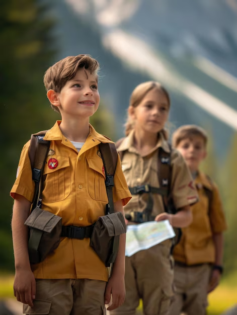

# scout-tv

## Scout TV

### Introduction

[https://github.com/vietphan1995/scout-tv.git](https://github.com/vietphan1995/scout-tv.git)

✉️ [Send to email: vietphan95@outlook.com](mailto:vietphan95@outlook.com?subject=register_idea:scout-tv_project&body=left_your_idea)

Scout tv is an internet media channels project to educate people living skills like:

- Rescue, saving people in danger place like river, beach, swimming pool, mountain, forest, snow, sand, … in danger context like accident, bad weather, …
- Improve knowledge about sick, food, chemistry, dangerous tool, dangerous animal, electric, …
- Planning, prepairing knowledge about camping, trekking, hiking, travel trip, …
- Violate, sex education.
- Reduce pollution environment, protect green environment knowledge.
- Following, maintaining rules, laws for safety community.

.

### [back to git projects …](https://github.com/vietphan1995/projects)

### Notes
https://maianhcorporation.notion.site/scout-tv-1b65e832d6ee80faafb1efb6121b57a2